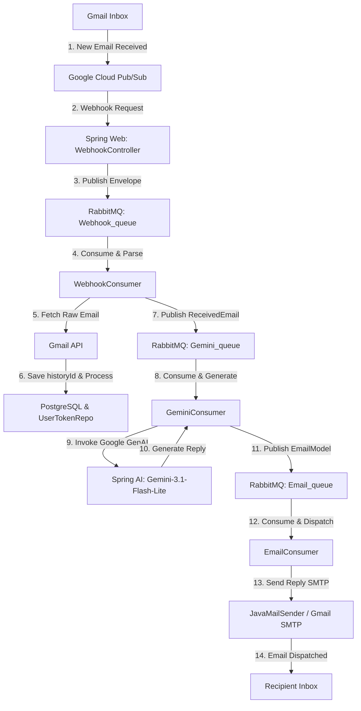
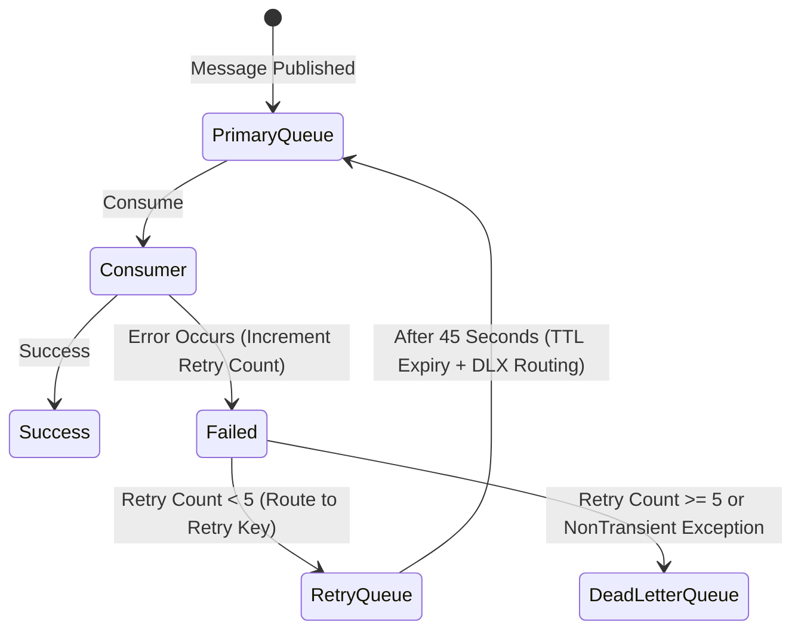

# Event-Driven AI Email Auto-Responder System

An enterprise-grade, event-driven automated email assistant built with **Spring Boot**, **Spring AI (Google Gemini)**, **Google Gmail & Pub/Sub API**, **RabbitMQ**, and **PostgreSQL**. 

The system automatically listens for incoming emails on registered Gmail accounts via Google Cloud Pub/Sub webhooks, processes them asynchronously, generates context-aware professional replies using Gemini LLM, and sends them out automatically with robust retry queues and dead-letter-exchange (DLX) error handling.

---

## 🚀 System Architecture & Working Pipeline



### Step-by-Step Processing Flow

1. **User Authentication & Watch Setup**:
   - The user signs in via `/login` (Google OAuth2).
   - Upon successful login, the `OAuthSuccessHandler` grabs the access and refresh tokens, sets up a Google Gmail API `watch` request on the user's `INBOX` label targeting a Google Cloud Pub/Sub topic, and saves the tokens and initial `historyId` in the database.
2. **Webhook Triggering**:
   - When a new email arrives in the user's Gmail inbox, Google Pub/Sub sends a push notification to `/api/v1/webhook/incoming-email`.
   - The payload contains base64-encoded history metadata.
3. **Queue Ingestion**:
   - The Webhook endpoint immediately routes the payload to the `Webhook_queue` using `WebhookPublisher` to keep response times low and ensure no notifications are lost.
4. **Email Fetching**:
   - `WebhookConsumer` consumes from `Webhook_queue`, decodes the envelope, checks if the email is already processed using `EmailTabelService`, and fetches the previous history ID.
   - It queries Gmail via `gmail.users().history().list()` to retrieve new messages since the last processed state.
   - It updates the database with the latest `historyId`.
5. **AI Content Generation**:
   - Each new email is parsed and forwarded to the `Gemini_queue`.
   - `GeminiConsumer` picks up the message, formats a prompt containing the subject and body, and sends it to the Gemini API (`gemini-3.1-flash-lite` model) via Spring AI.
   - Gemini produces a highly professional, context-aware reply body.
6. **Delivery Execution**:
   - The generated response is posted to the `Email_queue`.
   - `EmailConsumer` processes it, loads the sender credentials, and dispatches the reply email to the original sender using `JavaMailSender` (SMTP).

---

## 🛠️ RabbitMQ Topology & Fault Tolerance

The application employs a dual-queue structure (Primary & Retry) per pipeline component. The retry queue leverages **TTL (Time to Live)** and **Dead Letter Exchanges (DLX)** to perform automated back-off retries without blocking threads.



### 1. Webhook Notification Routing System
- **Exchange**: `Webhook_exchange` (Direct)
- **Primary Queue**: `Webhook_queue` (Key: `webhook_routing`)
- **Retry Queue**: `Webhook_Retry_queue` (Key: `webhook_retry_routing`)
  - *TTL*: 45,000 ms (45 seconds)
  - *DLX*: `Webhook_exchange` (DLX Key: `webhook_routing`)
  - Redirects failed notifications back to the primary queue for reprocessing up to 5 times.

### 2. Gemini System
- **Exchange**: `Gemini_exchange` (Direct)
- **Primary Queue**: `Gemini_queue` (Key: `gemini_routing`)
- **Retry Queue**: `Gemini_Retry_queue` (Key: `gemini_retry_routing`)
  - *TTL*: 45,000 ms
  - *DLX*: `Gemini_exchange` (DLX Key: `gemini_routing`)
  - Handles transient issues (e.g., Gemini API rate limit or service unavailability).
  - Immediately publishes to the Dead Letter Queue upon receiving a `NonTransientAiException`.

### 3. Email Delivery System
- **Exchange**: `Email_exchange` (Direct)
- **Primary Queue**: `Email_queue` (Key: `email_routing`)
- **Retry Queue**: `Email_Retry_queue` (Key: `email_retry_routing`)
  - *TTL*: 45,000 ms
  - *DLX*: `Email_exchange` (DLX Key: `email_routing`)
  - Handles network/SMTP delivery issues.

### 4. Dead Letter Queue (DLQ)
- **Exchange**: `Dead_Letter_exchange` (Direct)
- **Queue**: `Dead_Letter_queue` (Key: `Dead_Letter_key`)
- Messages are routed here if they exceed 5 delivery attempts or encounter unrecoverable errors. The header `x-last-error` is populated with the root exception message.

---

## 🗄️ Database Schema (PostgreSQL)

The system uses **Spring Data JPA** with Hibernate to automatically update/generate the tables.

### 1. `usertokens`
Stores OAuth2 access/refresh tokens and Gmail sync states.
| Column | Type | Constraints | Description |
| :--- | :--- | :--- | :--- |
| `id` | `BIGINT` | Primary Key, Auto-Increment | Database ID |
| `email` | `VARCHAR` | Unique, Not Null | User's Gmail Address |
| `access_token` | `TEXT` | | Google OAuth2 Access Token |
| `refresh_token` | `TEXT` | | Google OAuth2 Refresh Token |
| `last_history_id`| `TEXT` | | Stored Gmail history cursor |
| `expiration_time_millis`| `BIGINT` | | Expiry time of the OAuth2 token |

### 2. `emaildata`
Logs processed transactions and helps deduplicate webhook push events.
| Column | Type | Constraints | Description |
| :--- | :--- | :--- | :--- |
| `id` | `BIGINT` | Primary Key, Auto-Increment | Transaction ID |
| `message_id` | `VARCHAR` | Unique, Not Null | Google Message ID |
| `sender` | `VARCHAR` | Not Null | Sender email address |
| `receiver` | `VARCHAR` | Not Null | Receiver email address |
| `status` | `VARCHAR` | Not Null | Processing state |
| `time_stamp` | `TIMESTAMP` | Not Null | Insertion timestamp |

### 3. `userdata_table`
Monitors performance and logs statistics per user.
| Column | Type | Constraints | Description |
| :--- | :--- | :--- | :--- |
| `id` | `BIGINT` | Primary Key, Auto-Increment | Statistics Row ID |
| `email` | `VARCHAR` | Unique, Not Null | Registered Gmail Address |
| `received_emails`| `INT` | | Counter of total received emails |
| `sent` | `INT` | | Counter of successfully sent auto-replies |
| `failure` | `INT` | | Counter of failed transaction operations |
| `no_reply` | `INT` | | Counter of ignored emails |

---

## 🔌 API Endpoints Reference

### 1. Webhook Controller (`/api/v1/webhook`)
| HTTP Method | Endpoint | Request/Response Body | Description |
| :--- | :--- | :--- | :--- |
| **POST** | `/incoming-email` | **Body:** `PubSubEnvelope` | Google Cloud Pub/Sub push webhook endpoint. Automatically triggers email download pipeline. |
| **GET** | `/profile` | **Returns:** Profile JSON | Retrieves current user profile details from Google Gmail API. |
| **GET** | `/latest-emails/{num}` | **Returns:** List JSON | Retrieves metadata for the `{num}` latest emails in the inbox. |
| **GET** | `/msgs` | **Returns:** List JSON | Lists basic summaries of all emails in the inbox. |
| **GET** | `/msgs/{id}` | **Returns:** Message JSON | Retrieves details of a specific message by its unique ID. |
| **GET** | `/new-emails` | **Returns:** List JSON | Fetches inbox emails received in the last 24 hours. |

### 2. Email Controller (`/api/v1/email`)
| HTTP Method | Endpoint | Request/Response Body | Description |
| :--- | :--- | :--- | :--- |
| **POST** | `/send` | **Body:** `EmailModel` | Manually publishes a transaction to `Email_queue` to send a direct message. |
| **POST** | `/gemini` | **Body:** `EmailModel` | Manually publishes an email to `Gemini_queue` to draft a response through the AI pipeline. |

---

## ⚙️ Environment Configuration

Ensure a `.env` file is created at the root of the project. Spring Boot loads this using the `spring.config.import=optional:file:.env[.properties]` directive.

```properties
# SMTP configuration (Gmail example)
MAIL_USERNAME_1=your_gmail@gmail.com
MAIL_PASSWORD_1=your_app_specific_password

# Spring AI Gemini Integration
GEMINI_API_KEY=your_gemini_api_key

# Google OAuth2 Credentials
OAUTH_CLIENT_ID=your_oauth_client_id.apps.googleusercontent.com
OAUTH_CLIENT_SECRET=your_oauth_client_secret

# Database
POSTGRES_PASSWORD=your_postgres_db_password
```

> [!NOTE]
> To register a Google watch on user inboxes, ensure your Google Cloud Credentials have the required permissions (`https://www.googleapis.com/auth/gmail.modify` and `https://www.googleapis.com/auth/pubsub`) enabled in the GCP Console OAuth Consent Screen.

---

## 📦 Running the Application

### 🐳 Option 1: Docker Compose (Recommended)
This starts RabbitMQ and the Spring Boot application containerized together:
```bash
docker-compose up --build
```
The application will start, expose its HTTP server on `http://localhost:8080`, and configure RabbitMQ Broker/Management Console on ports `5672` & `15672`.

### 💻 Option 2: Run Locally
1. Start your local PostgreSQL instance (or uncomment PostgreSQL service in `docker-compose.yml`) and local RabbitMQ.
2. Build the project using Maven:
   ```bash
   mvn clean package -DskipTests
   ```
3. Run the application:
   ```bash
   mvn spring-boot:run
   ```
